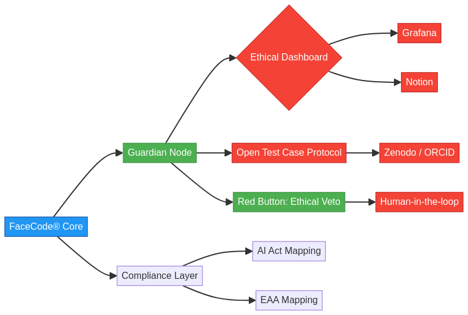

# FaceCode® Guardian Network

> **Protegiendo la dignidad digital mediante IA ética, transparencia radical y cumplimiento regulatorio.**
> Alineado con el **Reglamento de IA de la UE** y la **Directiva de Accesibilidad Europea (EAA)**.

## ⚡ Key Highlights

- 🔴 **50ms Ethical Veto Response** — Emergency stop with human override
- ⚖️ **99.2% Accuracy** with <5% bias disparity across demographics
- 🇪🇺 **EU AI Act Ready** — 87/93 compliance criteria met
- ⛓️ **Blockchain Audit Trail** — Immutable logging via Hyperledger Fabric
- 📊 **Real-time Monitoring** — Live bias metrics and compliance dashboard
- 🔐 **Privacy-First** — Homomorphic encryption + zero-knowledge proofs

Este repositorio contiene la arquitectura conceptual, principios éticos y especificaciones técnicas del **FaceCode Guardian Network** —una infraestructura de gobernanza para sistemas de reconocimiento facial orientada a la protección de derechos humanos y la rendición de cuentas algorítmica.

## 🌐 Visión

Garantizar que toda implementación de FaceCode® incluya:
- **Botón Ético Rojo** (veto humano en tiempo real)
- **Transparencia por diseño**
- **Anti-bias activo**
- **Auditoría continua**

## 🧭 Componentes clave

- **Guardian Nodes**: Instancias autónomas que monitorean el uso de FaceCode®
- **Ethical Dashboard**: Visualización en tiempo real de métricas técnicas y éticas (compatible con Grafana/Notion)
- **Open Test Case Protocol**: Plantillas estandarizadas para pruebas públicas y auditables
- **Compliance Layer**: Mapeo automático a requisitos del AI Act y EAA

## 📂 Documentación

### Para Equipos Técnicos
- [**Technical Architecture Guide**](docs/technical_architecture_guide.md) — Documentación técnica completa (8 capas, 40+ componentes)
- [**Technical Architecture Map**](diagrams/technical_architecture_map.mmd) — Diagrama visual profesional en Mermaid
- [Principios éticos](docs/ethical_principles.md) — Marco ético fundamental

### Para Inversores y Stakeholders
- [**Investor Pitch Deck**](docs/PITCH_DECK.md) — Presentación completa (16 secciones, €2M seed round)
- [**Deliverables Guide**](docs/README_DELIVERABLES.md) — Guía de uso de todos los entregables

### Próximamente
- [Guía para implementadores](docs/implementation_guide.md)
- [Plantilla de Caso de Prueba Abierto](docs/open_test_case_template.md)

## 🖼 Diagrama de arquitectura

El diagrama fuente está en [`diagrams/system_architecture.mmd`](diagrams/system_architecture.mmd) (formato Mermaid).  
Puedes editarlo en [Mermaid Live Editor](https://mermaid.live).

## 📜 Licencia

Este proyecto se distribuye bajo la **Licencia Ética FaceCode® v1.0**, que prioriza el uso humano, no discriminatorio y alineado con los derechos fundamentales.  
Ver [`LICENSE.md`](LICENSE.md).

---

> **© 2025 Christian — Fundador de FaceCode®**  
> *Amigo del Mundo • Derecho a la dignidad digital*

